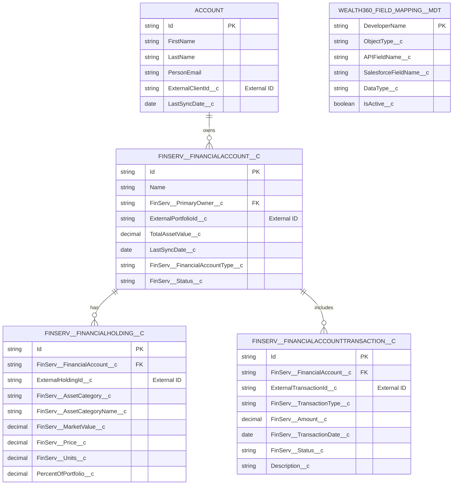
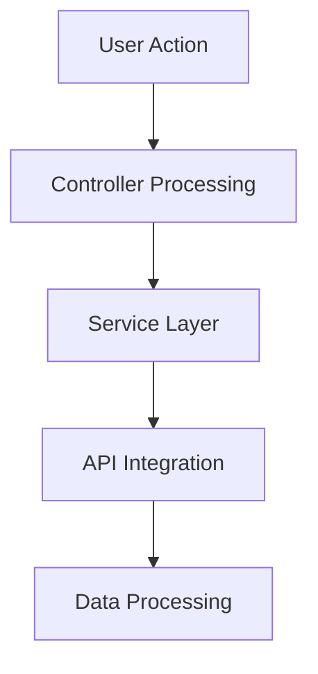
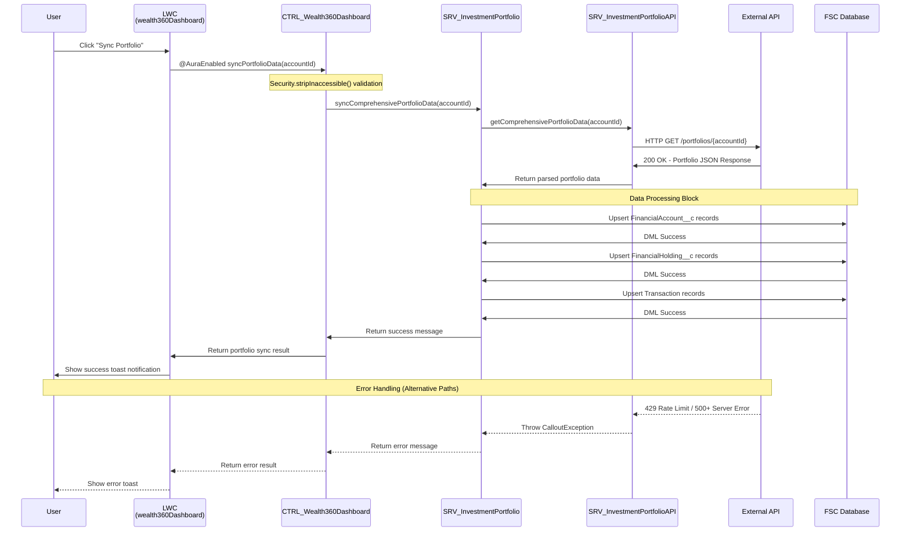
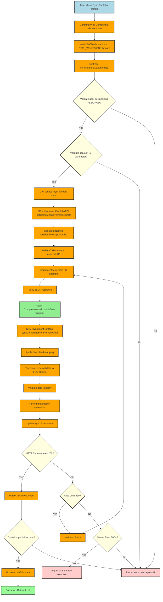
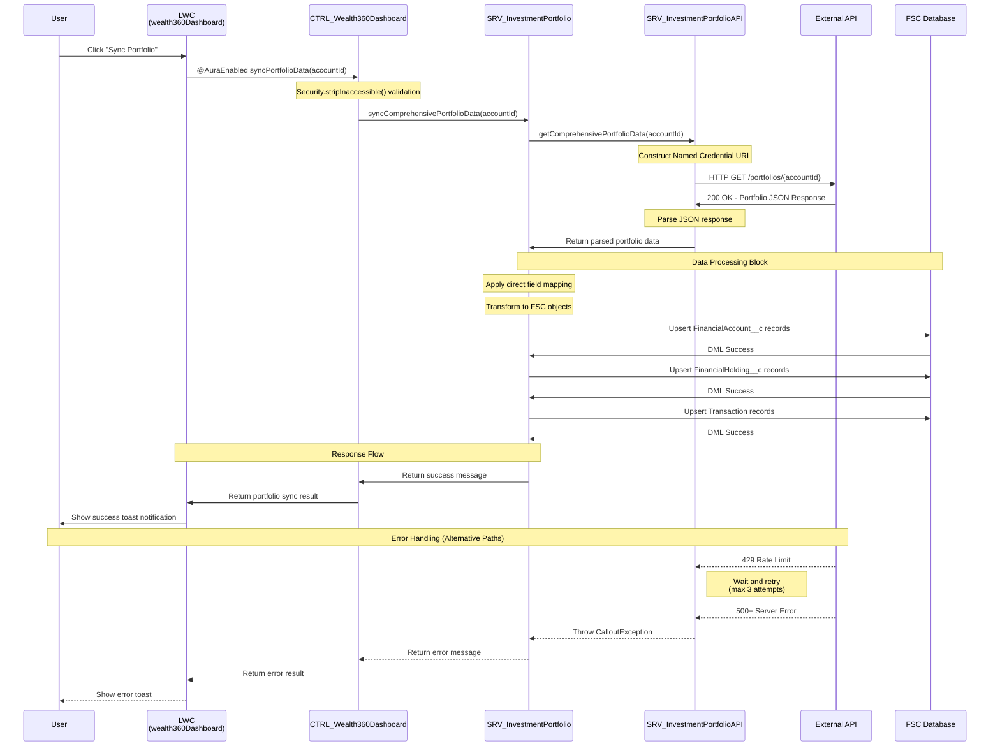

# Draw.io Prompts for Wealth360 FSC Assessment Diagrams

---

**Project:** Wealth360 FSC Assessment  
**Date:** January 14, 2026  
**Purpose:** Essential technical diagram prompts for technical documentation  

---

## 🏗️ **1. SIMPLIFIED ARCHITECTURE OVERVIEW**

### Draw.io Prompt:
```
Create a clean, modern architecture diagram with the following layers:

**PRESENTATION TIER (Top)**
- Box: "Wealth360 Dashboard (Lightning Web Component)"
- Features: Real-time Portfolio Metrics ($7.3M+ Support), Interactive Asset Allocation Charts, Transaction History DataTables, One-click Sync Functionality
- Color: Light Blue (#E3F2FD)

**CONTROLLER TIER (Second)**
- Box: "CTRL_Wealth360Dashboard (Apex Controller)"
- Features: Security Enforced Queries, FLS/CRUD Validation, Error Handling & Logging, Caching for Performance
- Color: Light Green (#E8F5E8)

**SERVICE TIER (Third - Split into two boxes)**
- Left Box: "SRV_InvestmentPortfolio" - Business Logic, Direct Field Mapping, Bulk Operations, Error Handling
- Right Box: "SRV_InvestmentPortfolioAPI" - HTTP Callouts, Named Credentials, Retry Logic, Response Parsing
- Color: Light Orange (#FFF3E0)

**DATA TIER (Bottom)**
- Box: "Financial Services Cloud Objects"
- Objects: FinServ__FinancialAccount__c (Portfolios), FinServ__FinancialHolding__c (Holdings), FinServ__FinancialAccountTransaction__c (Transactions)
- Custom Fields: ExternalPortfolioId__c, TotalAssetValue__c
- Color: Light Purple (#F3E5F5)

**EXTERNAL SYSTEM (Right side)**
- Box: "Investment Portfolio API (External)"
- Features: Portfolio Data, Holdings Information, Transaction History, Real-time Market Data
- Color: Light Grey (#F5F5F5)

Use arrows to show data flow:
- @wire/@AuraEnabled from Dashboard to Controller
- Service calls from Controller to both Service boxes
- HTTPS/REST API from API service to External System
- Database operations from Business Logic to Data Tier

Add labels for protocols: @wire, HTTPS, SOQL, DML
Style: Modern, clean boxes with rounded corners, professional color scheme
```

---

## 🗃️ **2. DATA MODEL ENTITY RELATIONSHIP DIAGRAM**

### Draw.io Prompt:
```
Create a comprehensive ERD for Financial Services Cloud objects as shown in the project:

**ACCOUNT (Top)**
- Table with fields: Id (PK), FirstName, LastName, PersonEmail, ExternalClientId__c (External ID), LastSyncDate__c
- Color: Light Blue (#E3F2FD)
- Relationship: 1:N to Financial Account ("owns")

**FINSERV__FINANCIALACCOUNT__C (Center)**
- Table with fields: Id (PK), Name, FinServ__PrimaryOwner__c (FK), ExternalPortfolioId__c (External ID), TotalAssetValue__c, LastSyncDate__c, FinServ__FinancialAccountType__c, FinServ__Status__c
- Color: Light Green (#E8F5E8)
- Relationships: N:1 to Account, 1:N to Holdings ("has"), 1:N to Transactions ("includes")

**FINSERV__FINANCIALHOLDING__C (Left bottom)**
- Table with fields: Id (PK), FinServ__FinancialAccount__c (FK), ExternalHoldingId__c (External ID), FinServ__AssetCategory__c, FinServ__AssetCategoryName__c, FinServ__MarketValue__c, FinServ__Price__c, FinServ__Units__c, PercentOfPortfolio__c
- Color: Light Orange (#FFF3E0)

**FINSERV__FINANCIALACCOUNTTRANSACTION__C (Right bottom)**
- Table with fields: Id (PK), FinServ__FinancialAccount__c (FK), ExternalTransactionId__c (External ID), FinServ__TransactionType__c, FinServ__Amount__c, FinServ__TransactionDate__c, FinServ__Status__c, Description__c
- Color: Light Purple (#F3E5F5)

**WEALTH360_FIELD_MAPPING__MDT (Far right)**
- Table with fields: DeveloperName (PK), ObjectType__c, APIFieldName__c, SalesforceFieldName__c, DataType__c, IsActive__c
- Color: Light Yellow (#FFFDE7)

Use standard ERD notation:
- Primary keys marked with (PK)
- Foreign keys marked with (FK)
- External IDs marked with (External ID)
- Relationship lines with cardinality (1:N, N:1)
- Crow's foot notation for many relationships
```

### Mermaid ERD Syntax:


---

## ⚙️ **3. LOGIC FLOW DIAGRAM**

### Placeholder - To be updated with actual process flow
```
[PLACEHOLDER]
- Will show complete synchronization workflow
- User interaction → Controller validation → Service processing → API integration → Data persistence
- Include error handling and retry logic
- Decision points for validation and error scenarios
```

### Mermaid Flowchart Template:


---

## 🔄 **4. INTEGRATION FLOW SEQUENCE DIAGRAM**

### Draw.io Prompt:
```
Create a detailed sequence diagram for Wealth360 Portfolio Sync Process:

**PARTICIPANTS (Top row, left to right)**
- "User" - Light Blue (#E3F2FD)
- "LWC (wealth360Dashboard)" - Light Green (#E8F5E8) 
- "CTRL_Wealth360Dashboard" - Light Orange (#FFF3E0)
- "SRV_InvestmentPortfolio" - Light Yellow (#FFFDE7)
- "SRV_InvestmentPortfolioAPI" - Light Purple (#F3E5F5)
- "External API" - Light Grey (#F5F5F5)
- "FSC Database" - Light Pink (#FCE4EC)

**SEQUENCE FLOW (Based on actual project sequence)**
1. User → LWC: "Click 'Sync Portfolio'"
2. LWC → CTRL: "@AuraEnabled syncPortfolioData(accountId)"
3. CTRL → CTRL: "Security.stripInaccessible() validation"
4. CTRL → SRV_Portfolio: "syncComprehensivePortfolioData(accountId)"
5. SRV_Portfolio → SRV_API: "getComprehensivePortfolioData(accountId)"
6. SRV_API → External API: "HTTP GET /portfolios/{accountId}"
7. External API → SRV_API: "200 OK - Portfolio JSON Response"
8. SRV_API → SRV_Portfolio: "Return parsed portfolio data"
9. SRV_Portfolio → FSC Database: "Upsert FinancialAccount__c records"
10. SRV_Portfolio → FSC Database: "Upsert FinancialHolding__c records"
11. SRV_Portfolio → FSC Database: "Upsert Transaction records"
12. SRV_Portfolio → CTRL: "Return success message"
13. CTRL → LWC: "Return portfolio sync result"
14. LWC → User: "Show success toast notification"

**ERROR HANDLING FLOWS**
- Rate limiting (429) with retry logic
- Server errors (5xx) with CalloutException
- Error propagation back through all layers

**STYLING INSTRUCTIONS:**
- Use solid arrows for synchronous calls
- Use red arrows/text for errors
- Use green arrows/text for success paths
- Add activation boxes (lifelines) for active processing
- Include sequence numbers on arrows
- Group related operations with frames
```

### Mermaid Sequence Syntax:


---

## 📱 **Usage Instructions for Draw.io:**

1. **Open Draw.io** (app.diagrams.net)
2. **Create New Diagram** → Choose "Blank Diagram"
3. **Copy and paste** the specific prompt into ChatGPT or Claude
4. **Use the generated description** to manually create the diagram in Draw.io
5. **Apply suggested colors** using the color codes provided
6. **Use shape libraries:** 
   - General shapes for basic boxes and arrows
   - UML for component diagrams
   - Flowchart for process flows
   - Entity Relation for data models
7. **Export as PNG/SVG** for documentation

**Pro Tips:**
- Use consistent colors across all diagrams
- Apply rounded corners for a modern look
- Use the same font family throughout
- Add drop shadows for professional appearance
- Group related elements for easier editing

---

## 📋 **Technical Design Document Integration:**

This diagram collection supports the technical design document in your project:
- [COMPREHENSIVE_TECHNICAL_DESIGN.md](docs/COMPREHENSIVE_TECHNICAL_DESIGN.md)

**Next Steps:**
1. Provide specific diagram content for placeholders
2. Create diagrams in Draw.io using the Architecture Overview prompt
3. Update placeholders with actual project-specific content
4. Export diagrams and integrate with technical documentation

---

---

## ⚙️ **3. LOGIC FLOW DIAGRAM**

### Draw.io Prompt:
```
Create a detailed process flow diagram showing synchronization workflow:

**USER INTERACTION (Top)**
- Start: "User clicks 'Sync Portfolio' button"
- Process: "Lightning Web Component calls controller"
- Detail: "wealth360Dashboard.js → CTRL_Wealth360Dashboard"

**CONTROLLER LOGIC (Second tier)**
- Process: "CTRL_Wealth360Dashboard.syncPortfolioData()"
- Decision diamonds: "Validate user permissions (FLS/CRUD)?", "Validate account ID parameter?"
- Process: "Call service layer for data sync"
- End: "Return success/error message to UI"

**SERVICE LOGIC (Third tier)**
- Process: "SRV_InvestmentPortfolioAPI.getComprehensivePortfolioData()"
- Subprocess: "Construct Named Credential endpoint URL", "Make HTTP callout to external API", "Implement retry logic (3 attempts)", "Parse JSON response"
- Return: "Return ComprehensivePortfolioData wrapper"

**DATA PROCESSING LOGIC (Fourth tier)**
- Process: "SRV_InvestmentPortfolio.syncComprehensivePortfolioData()"
- Subprocess: "Apply direct field mapping", "Transform external data to FSC objects", "Validate data integrity", "Perform bulk upsert operations", "Update sync timestamps"

**DECISION LOGIC (Bottom)**
- Decision flow: "HTTP Status = 200?" → Yes/No branches
- Success path: "Parse JSON response" → "Contains 'portfolios'?" → "Process portfolio data"
- Error paths: "429 (Rate Limit)?" → "Wait & Retry", "500+ (Server Error)?" → "Log error & throw exception"

Use flowchart symbols:
- Rounded rectangles for start/end
- Rectangles for processes
- Diamonds for decisions
- Parallelograms for input/output
- Arrows showing flow direction
- Colors: Blue for user actions, Green for success, Red for errors, Orange for processes
```

### Alternative: Fixed Mermaid Flowchart Syntax


---

## 🔐 **4. SECURITY CONTROLS DIAGRAM**

### Draw.io Prompt:
```
Create a comprehensive security architecture diagram:

**AUTHENTICATION LAYER (Top)**
- Box: "Named Credential Security"
- Features: OAuth 2.0 Integration, Certificate-based Authentication, Token Refresh Automation, Credential Isolation
- Color: Red (#FFEBEE)

**AUTHORIZATION LAYER (Second)**
- Box: "Salesforce Security Model"
- Features: Profile & Permission Sets, Field-Level Security (FLS), Object-Level Security (CRUD), Sharing Rules
- Color: Orange (#FFF3E0)

**DATA PROTECTION (Third - Split)**
- Left Box: "Data in Transit" - HTTPS/TLS 1.2+, Certificate Pinning, Request Signing, IP Whitelisting
- Right Box: "Data at Rest" - Salesforce Shield Encryption, Field Encryption, Audit Trail, Data Retention
- Color: Blue (#E3F2FD)

**ACCESS CONTROLS (Fourth)**
- Box: "Code-Level Security"
- Features: Security.stripInaccessible(), WITH SECURITY_ENFORCED, Input Validation, Rate Limiting
- Color: Green (#E8F5E8)

**COMPLIANCE (Bottom)**
- Box: "Regulatory Compliance"
- Features: POPI Act, GDPR Readiness, SOX Compliance, PCI DSS, Audit Trail, Data Privacy Controls
- Color: Purple (#F3E5F5)

Show security checkpoints with shield icons and lock symbols
Use arrows to show security validation flow from user request to data access
Add "SECURE" labels on all communication paths
```

---

## 📊 **5. BUSINESS PROCESS FLOW - CURRENT vs FUTURE STATE**

### Draw.io Prompt:
```
Create a before/after process comparison diagram:

**CURRENT STATE (Top half)**
Title: "Manual Process Flow"
- Step 1: "Advisor receives client meeting request"
- Step 2: "Manually login to multiple external systems"  
- Step 3: "Export portfolio data from each platform"
- Step 4: "Consolidate data in spreadsheets"
- Step 5: "Create presentation materials manually"
- Step 6: "Conduct client meeting with potentially outdated data"
- Step 7: "Update Salesforce manually after meeting"

Pain Points (Red warning icons): 2-3 hours manual data preparation, Data silos across multiple systems, Risk of human error, No real-time updates, Inconsistent data presentation

**FUTURE STATE (Bottom half)**
Title: "Automated Process Flow"
- Step 1: "Advisor opens Salesforce FSC client record"
- Step 2: "Wealth360 dashboard displays real-time portfolio data"
- Step 3: "One-click sync updates all portfolio information"
- Step 4: "Interactive charts and analytics available instantly"
- Step 5: "Advisor focuses on strategic recommendations"
- Step 6: "All interactions automatically logged in Salesforce"
- Step 7: "Compliance reports generated automatically"

Benefits (Green check icons): 5-minute data access (vs. 3 hours), Single source of truth, Zero manual data entry, Real-time updates, Consistent professional presentation

Use swim lanes to separate current vs future
Color: Current state in red/orange tones, Future state in green/blue tones
Add time indicators showing process improvement (3 hours → 5 minutes)
```

---

## 📈 **6. FIELD MAPPING VISUALIZATION**

### Draw.io Prompt:
```
Create a data transformation flow diagram:

**API RESPONSE (Left side)**
- Box: "External API JSON Response"
- Sample fields: portfolioId, name, total_value, status, holdingId, asset_name, market_value, transactionId, transaction_type, amount, transaction_date
- Color: Light Grey (#F5F5F5)

**MAPPING ENGINE (Center)**
- Box: "Direct Field Mapping Logic"
- Process steps: "1. Extract field from API", "2. Apply data type conversion", "3. Validate required fields", "4. Set value on Salesforce object"
- Color: Light Blue (#E3F2FD)

**SALESFORCE OBJECTS (Right side)**
- Three boxes for:
  1. "FinServ__FinancialAccount__c" - ExternalPortfolioId__c, Name, TotalAssetValue__c, FinServ__Status__c
  2. "FinServ__FinancialHolding__c" - ExternalHoldingId__c, FinServ__AssetCategoryName__c, FinServ__MarketValue__c
  3. "FinServ__FinancialAccountTransaction__c" - ExternalTransactionId__c, FinServ__TransactionType__c, FinServ__Amount__c, FinServ__TransactionDate__c
- Color: Light Green (#E8F5E8)

**DATA TYPE CONVERSION (Bottom)**
- Show conversion rules: String → Text, Decimal → Currency, Date → Date, Boolean → Checkbox
- Color: Light Yellow (#FFFDE7)

Use arrows to show mapping relationships
Add transformation symbols (gears) on the arrows
Include validation checkpoints (diamond shapes) for required fields
```

---

## 🏛️ **7. ARCHITECTURE PRINCIPLES DIAGRAM**

### Draw.io Prompt:
```
Create a principles hierarchy diagram:

**CORE PRINCIPLE (Center)**
- Large circle: "Simplicity & Reliability"
- Central focus with radiating spokes

**PRIMARY PRINCIPLES (Inner ring - 4 circles)**
1. "Clean Architecture" - 8 focused classes, single responsibility
2. "Direct Mapping" - No complex metadata dependencies  
3. "Graceful Errors" - Partial failure support with logging
4. "Clear Separation" - API, Business Logic, UI layers

**SECONDARY PRINCIPLES (Outer ring - 6 circles)**
1. "Bulk Operations" - Efficient large dataset handling
2. "Partial Success" - Continue despite individual failures
3. "Minimal Queries" - Optimized SOQL with security
4. "Response Caching" - Improved dashboard performance
5. "Security First" - WITH SECURITY_ENFORCED throughout
6. "Maintainable Code" - Clean, readable, documented

**BENEFITS (Outer boxes)**
- "Performance" - Sub-second response times
- "Scalability" - Handles $7.3M+ portfolios
- "Maintainability" - Easy to modify and extend
- "Reliability" - Production-ready error handling

Use a hub-and-spoke design
Colors: Center in gold, Inner ring in blue, Outer ring in green, Benefits in purple
Connect related principles with dotted lines
Add icons for each principle (gear for architecture, shield for security, etc.)
```

---

## 📋 **8. COMPONENT RELATIONSHIP DIAGRAM**

### Draw.io Prompt:
```
Create a detailed component dependency diagram:

**FRONTEND COMPONENTS (Top)**
- "wealth360Dashboard.js" - Main LWC component
- "wealth360Dashboard.html" - UI template
- "wealth360Dashboard.css" - Styling
- Color: Light Blue (#E3F2FD)

**CONTROLLER LAYER (Second)**
- "CTRL_Wealth360Dashboard.cls" - UI controller
- Dependencies: Security validation, error handling, caching
- Color: Light Green (#E8F5E8)

**SERVICE LAYER (Third - Two columns)**
- Left: "SRV_InvestmentPortfolio.cls" - Business logic service
- Right: "SRV_InvestmentPortfolioAPI.cls" - API integration service
- Color: Light Orange (#FFF3E0)

**DATA LAYER (Fourth)**
- "DTO_Wealth360Dashboard.cls" - Data transfer objects
- Custom FSC objects and fields
- Color: Light Purple (#F3E5F5)

**TEST LAYER (Fifth)**
- "SRV_InvestmentPortfolio_Test.cls" - Business logic tests
- "SRV_InvestmentPortfolioAPI_Test.cls" - API service tests  
- "CTRL_Wealth360Dashboard_Test.cls" - Controller tests
- "TEST_DataFactory.cls" - Test data utility
- "MOCK_InvestmentPortfolioAPI.cls" - HTTP mock
- Color: Light Yellow (#FFFDE7)

Show dependencies with solid arrows (uses/calls)
Show test relationships with dashed arrows (tests)
Add annotation boxes showing key features for each component
Use UML-style component notation with component symbols
```

---

## 🔄 **9. DEPLOYMENT FLOW DIAGRAM**

### Draw.io Prompt:
```
Create a CI/CD deployment pipeline diagram:

**DEVELOPMENT (Left)**
- Box: "Local Development"
- Steps: Code changes, Unit testing, Git commit
- Color: Light Blue (#E3F2FD)

**SOURCE CONTROL (Second)**
- Box: "GitHub Repository"
- Features: Version control, Pull requests, Code review
- Color: Light Grey (#F5F5F5)

**BUILD PIPELINE (Third)**
- Box: "Automated Build"
- Steps: SFDX validation, Test execution, Package creation, Quality gates
- Color: Light Orange (#FFF3E0)

**DEPLOYMENT (Fourth)**
- Three environments vertically:
  1. "Sandbox" - Development testing
  2. "Staging" - UAT and integration testing  
  3. "Production" - Live deployment
- Color: Light Green (#E8F5E8)

**MONITORING (Right)**
- Box: "Production Monitoring"
- Features: Performance metrics, Error tracking, Usage analytics
- Color: Light Red (#FFEBEE)

Use pipeline arrows showing the flow from dev to production
Add quality gates (diamond shapes) between stages
Include rollback arrows (red dotted lines) for emergency procedures
Add deployment artifacts (package icons) at transition points
Show parallel testing tracks with branching arrows
```

---

## 💾 **10. DATA MIGRATION STRATEGY DIAGRAM**

### Draw.io Prompt:
```
Create a comprehensive data migration flow:

**SOURCE SYSTEMS (Left)**
- Multiple legacy system boxes: "Legacy Portfolio DB", "Transaction History", "Client Data"
- Color: Light Red (#FFEBEE)

**ETL PLATFORM (Center)**
- Box: "ETL Platform"
- Tools: Talend, DataLoader, Custom Apex, Validation
- Process steps: Extract → Validate → Transform → Load
- Color: Light Blue (#E3F2FD)

**SALESFORCE (Right)**
- Box: "Salesforce FSC"
- Components: FSC Orgs, Bulk API, Streaming API
- Color: Light Green (#E8F5E8)

**DATA QUALITY PIPELINE (Bottom)**
- Sequential steps: "1. Extract" → "2. Validate" → "3. Transform" → "4. Load"
- Under each step: "CSV/JSON Exports", "Completeness/Accuracy", "Field Mapping/Data Types", "Bulk Insert/Error Handling"
- Color: Light Yellow (#FFFDE7)

**VALIDATION CHECKPOINTS (Scattered)**
- Diamond shapes for: "Pre-Migration Validation", "Process Validation", "Post-Migration Validation"
- Color: Light Purple (#F3E5F5)

Show data flow with thick arrows
Add data volume indicators (record counts)
Include validation checkpoints with success/failure paths
Add timeline indicators showing migration phases
Use different arrow styles for different data types
```

---

## � **11. INTEGRATION FLOW SEQUENCE DIAGRAM**

### Draw.io Prompt:
```
Create a detailed sequence diagram for Wealth360 Portfolio Sync Process showing synchronous integration flow:

**PARTICIPANTS (Top row, left to right)**
- "User" - Light Blue (#E3F2FD)
- "LWC (wealth360Dashboard)" - Light Green (#E8F5E8) 
- "CTRL_Wealth360Dashboard" - Light Orange (#FFF3E0)
- "SRV_InvestmentPortfolio" - Light Yellow (#FFFDE7)
- "SRV_InvestmentPortfolioAPI" - Light Purple (#F3E5F5)
- "External API" - Light Grey (#F5F5F5)
- "FSC Database" - Light Pink (#FCE4EC)

**SEQUENCE FLOW (Top to bottom)**
1. User → LWC: "Click 'Sync Portfolio'"
2. LWC → CTRL: "@AuraEnabled syncPortfolioData(accountId)"
3. CTRL → CTRL: "Security.stripInaccessible() validation"
4. CTRL → SRV_Portfolio: "syncComprehensivePortfolioData(accountId)"
5. SRV_Portfolio → SRV_API: "getComprehensivePortfolioData(accountId)"
6. SRV_API → SRV_API: "Construct Named Credential URL"
7. SRV_API → External API: "HTTP GET /portfolios/{accountId}"
8. External API → SRV_API: "200 OK - Portfolio JSON Response"
9. SRV_API → SRV_API: "Parse JSON response"
10. SRV_API → SRV_Portfolio: "Return parsed portfolio data"

**DATA PROCESSING BLOCK**
11. SRV_Portfolio → SRV_Portfolio: "Apply direct field mapping"
12. SRV_Portfolio → SRV_Portfolio: "Transform to FSC objects"
13. SRV_Portfolio → FSC Database: "Upsert FinancialAccount__c records"
14. FSC Database → SRV_Portfolio: "DML Success"
15. SRV_Portfolio → FSC Database: "Upsert FinancialHolding__c records"
16. FSC Database → SRV_Portfolio: "DML Success"
17. SRV_Portfolio → FSC Database: "Upsert Transaction records"
18. FSC Database → SRV_Portfolio: "DML Success"

**RESPONSE FLOW**
19. SRV_Portfolio → CTRL: "Return success message"
20. CTRL → LWC: "Return portfolio sync result"
21. LWC → User: "Show success toast notification"

**ERROR HANDLING FLOWS (Alternative paths)**
22. External API → SRV_API: "429 Rate Limit" [Red arrow]
23. SRV_API → SRV_API: "Wait and retry (max 3 attempts)" [Orange self-loop]
24. External API → SRV_API: "500+ Server Error" [Red arrow]
25. SRV_API → SRV_Portfolio: "Throw CalloutException" [Red arrow]
26. SRV_Portfolio → CTRL: "Return error message" [Red arrow]
27. CTRL → LWC: "Return error result" [Red arrow]
28. LWC → User: "Show error toast" [Red arrow]

**STYLING INSTRUCTIONS:**
- Use solid arrows for synchronous calls
- Use red arrows/text for errors
- Use green arrows/text for success paths
- Use orange arrows/text for retries
- Add activation boxes (lifelines) for active processing
- Include sequence numbers (1, 2, 3...) on arrows
- Group related operations with frames/boxes
- Use proper UML sequence diagram notation
```

### Alternative: Mermaid Sequence Diagram Syntax


---

1. **Open Draw.io** (app.diagrams.net)
2. **Create New Diagram** → Choose "Blank Diagram"
3. **Copy and paste** the specific prompt into ChatGPT or Claude
4. **Use the generated description** to manually create the diagram in Draw.io
5. **Apply suggested colors** using the color codes provided
6. **Use shape libraries:** 
   - General shapes for basic boxes and arrows
   - UML for component diagrams
   - Flowchart for process flows
   - Entity Relation for data models
7. **Export as PNG/SVG** for documentation

**Pro Tips:**
- Use consistent colors across all diagrams
- Apply rounded corners for a modern look
- Use the same font family throughout
- Add drop shadows for professional appearance
- Group related elements for easier editing

---