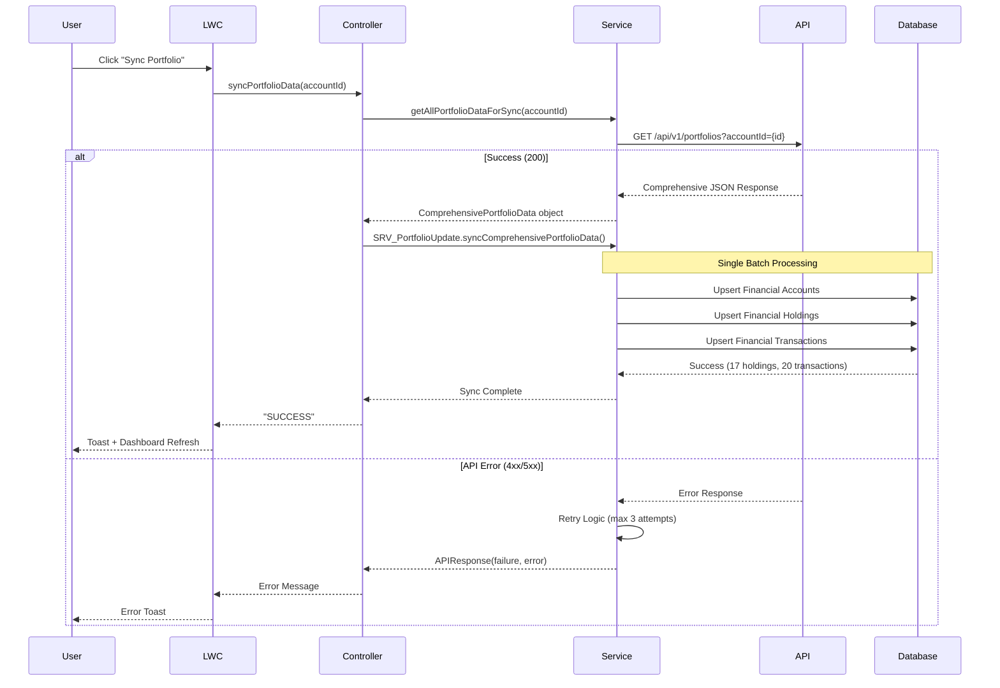

# Wealth360 - Technical Design Document

## Executive Summary
Wealth360 is a Financial Services Cloud (FSC) solution that provides financial advisors with a comprehensive 360-degree view of client investment portfolios by integrating external investment data with Salesforce's standard FSC objects.

**Version:** 1.0  
**Date:** November 22, 2025  
**Author:** Wealth360 Assessment Team

---

## 1. Architecture Overview

### 1.1 System Architecture Diagram
```
┌─────────────────────────────────────────────────────────────────┐
│                    Wealth360 Dashboard (LWC)                    │
│  ┌──────────────┐  ┌──────────────┐  ┌─────────────────────┐  │
│  │ Total Value  │  │ Asset Alloc  │  │ Recent Transactions │  │
│  │   Metrics    │  │  Pie Chart   │  │     DataTable       │  │
│  └──────────────┘  └──────────────┘  └─────────────────────┘  │
└────────────────────────────┬────────────────────────────────────┘
                             │ @wire / @AuraEnabled
                             ▼
┌─────────────────────────────────────────────────────────────────┐
│            CTRL_Wealth360Dashboard (with sharing)                │
│  - getTotalInvestmentValue()   - getAssetAllocation()           │
│  - getRecentTransactions()     - syncPortfolioData()            │
└────────────────────────────┬────────────────────────────────────┘
                             │
              ┌──────────────┴──────────────┐
              ▼                             ▼
┌──────────────────────────┐    ┌──────────────────────────┐
│  FSC Standard Objects    │    │   QUE_PortfolioSync      │
│  - FinancialAccount__c   │    │  (Queueable + Callouts)  │
│  - FinancialHolding__c   │    └───────────┬──────────────┘
│  - FinancialAccount      │                │
│    Transaction__c        │                ▼
└──────────────────────────┘    ┌──────────────────────────┐
                                │ SVC_InvestmentPortfolio  │
                                │  - HTTP Callouts         │
                                │  - Retry Logic           │
                                │  - Error Handling        │
                                └───────────┬──────────────┘
                                            │ Named Credential
                                            ▼
                        ┌────────────────────────────────────┐
                        │  External Investment Portfolio API  │
                        │   (Mock: MOCK_InvestmentPortfolioAPI)│
                        └────────────────────────────────────┘
```

### 1.2 Component Diagram
```
┌─────────────────────────────────────────────────────────────┐
│                      Presentation Layer                      │
│  ┌────────────────────────────────────────────────────────┐ │
│  │  wealth360Dashboard (LWC)                              │ │
│  │  - wealth360Dashboard.js                               │ │
│  │  - wealth360Dashboard.html                             │ │
│  │  - wealth360Dashboard.css                              │ │
│  └────────────────────────────────────────────────────────┘ │
└─────────────────────────────────────────────────────────────┘
                              │
┌─────────────────────────────────────────────────────────────┐
│                      Controller Layer                        │
│  ┌────────────────────────────────────────────────────────┐ │
│  │  CTRL_Wealth360Dashboard                               │ │
│  │  - @AuraEnabled(cacheable=true) methods                │ │
│  │  - Security.stripInaccessible()                        │ │
│  │  - WITH SECURITY_ENFORCED                              │ │
│  └────────────────────────────────────────────────────────┘ │
└─────────────────────────────────────────────────────────────┘
                              │
┌─────────────────────────────────────────────────────────────┐
│                      Service Layer                           │
│  ┌────────────────────────────────────────────────────────┐ │
│  │  SVC_InvestmentPortfolioService                        │ │
│  │  - HTTP callouts with retry logic                      │ │
│  │  - Response parsing                                     │ │
│  │  - Named Credential usage                              │ │
│  └────────────────────────────────────────────────────────┘ │
│  ┌────────────────────────────────────────────────────────┐ │
│  │  QUE_PortfolioSync (Queueable + AllowsCallouts)        │ │
│  │  - Async bulk processing                               │ │
│  │  - Job chaining                                         │ │
│  │  - Data transformation                                  │ │
│  └────────────────────────────────────────────────────────┘ │
└─────────────────────────────────────────────────────────────┘
                              │
┌─────────────────────────────────────────────────────────────┐
│                        Data Layer                            │
│  ┌────────────────────────────────────────────────────────┐ │
│  │  FSC Standard Objects (with custom fields)             │ │
│  │  - FinServ__FinancialAccount__c                        │ │
│  │    • ExternalPortfolioId__c (External ID)              │ │
│  │    • LastSyncDate__c                                    │ │
│  │    • TotalAssetValue__c                                │ │
│  │  - FinServ__FinancialHolding__c                        │ │
│  │    • ExternalHoldingId__c (External ID)                │ │
│  │    • PercentOfPortfolio__c                             │ │
│  │  - FinServ__FinancialAccountTransaction__c            │ │
│  │    • ExternalTransactionId__c (External ID)            │ │
│  └────────────────────────────────────────────────────────┘ │
└─────────────────────────────────────────────────────────────┘
```

## 2. Data Model & Architecture

### 2.1 FSC Object Relationships
```
Account (Person Account)
    │
    ├─→ FinServ__FinancialAccount__c (Master-Detail via PrimaryOwner__c)
    │       │ • Represents investment portfolios
    │       │ • Maps to external portfolio systems
    │       │ • Stores total asset values and metadata
    │       │
    │       ├─→ FinServ__FinancialHolding__c (Master-Detail)
    │       │       • Represents individual securities/assets
    │       │       • Stores asset category, market values, quantities
    │       │       • Supports percentage allocation calculations
    │       │
    │       └─→ FinServ__FinancialAccountTransaction__c (Master-Detail)
    │               • Represents buy/sell/dividend/rebalance transactions
    │               • Stores transaction type, amount, date, descriptions
    │               • Enables complete transaction history tracking
    │
    └─→ FinServ__FinancialAccountRole__c (Junction for joint accounts)
```

### 2.2 Custom Fields Implementation

#### FinServ__FinancialAccount__c Extensions
| Field Name | Type | Purpose | Notes |
|------------|------|---------|-------|
| ExternalPortfolioId__c | Text(50), External ID, Unique | Maps to external system portfolio ID | Used for upsert operations |
| LastSyncDate__c | DateTime | Tracks last successful sync | Enables delta sync strategies |
| TotalAssetValue__c | Currency(18,2) | Total value of all holdings | Calculated from API response |

#### FinServ__FinancialHolding__c Extensions
| Field Name | Type | Purpose | Notes |
|------------|------|---------|-------|
| ExternalHoldingId__c | Text(50), External ID, Unique | Maps to external holding ID | Prevents duplicate holdings |
| PercentOfPortfolio__c | Percent(5,2) | Percentage of total portfolio | Used for asset allocation charts |

#### FinServ__FinancialAccountTransaction__c Extensions
| Field Name | Type | Purpose | Notes |
|------------|------|---------|-------|
| ExternalTransactionId__c | Text(50), External ID, Unique | Maps to external transaction ID | Ensures transaction uniqueness |

### 2.3 Custom Metadata for Configuration

#### Wealth360_API_Config__mdt
Centralizes API configuration for different environments:
```apex
// Example record: Investment_Portfolio_API
{
    "Named_Credential__c": "InvestmentPortfolioAPI",
    "Portfolios_Endpoint__c": "/api/v1/portfolios",
    "Timeout_Milliseconds__c": 120000,
    "Retry_Count__c": 3,
    "Is_Active__c": true
}
```

#### Wealth360_Field_Mapping__mdt
Enables flexible field mapping between API responses and Salesforce fields:
```apex
// Example records for Portfolio mappings
{
    "Object_Type__c": "Portfolio",
    "API_Field_Name__c": "portfolioId", 
    "Salesforce_Field_Name__c": "ExternalPortfolioId__c",
    "Data_Type__c": "String",
    "Is_Active__c": true
}
```

### 2.4 Data Flow Architecture

#### Comprehensive API Integration Pattern
```
Single API Call Strategy:
┌─────────────────────────────────────────────────────────────┐
│ GET /api/v1/portfolios?accountId={id}                      │
│ ┌─────────────────────────────────────────────────────────┐ │
│ │ Response Structure:                                     │ │
│ │ {                                                       │ │
│ │   "portfolios": [...],           // Financial Accounts │ │
│ │   "holdingsByPortfolio": {...},  // Holdings by ID     │ │
│ │   "transactionsByPortfolio": {...} // Transactions    │ │
│ │ }                                                       │ │
│ └─────────────────────────────────────────────────────────┘ │
└─────────────────────────────────────────────────────────────┘
                              │
                              ▼
┌─────────────────────────────────────────────────────────────┐
│            SRV_InvestmentPortfolioAPI.cls                   │
│  • getAllPortfolioDataForSync(accountId)                   │
│  • parseComprehensiveData(responseMap)                     │
│  • makeCalloutWithRetry(endpoint, method, body)           │
└─────────────────────────────────────────────────────────────┘
                              │
                              ▼
┌─────────────────────────────────────────────────────────────┐
│              SRV_PortfolioUpdate.cls                       │
│  • syncComprehensivePortfolioData(accountId, data)        │
│  • upsertPortfolios(accountId, portfolios)                │
│  • upsertHoldings(financialAccountIds, data)              │
│  • upsertTransactions(financialAccountIds, data)          │
│  • applyFieldMappings(objectType, apiData, record)        │
└─────────────────────────────────────────────────────────────┘
```

### 2.5 Field Mapping Strategy

#### Metadata-Driven Mapping with Fallbacks
```apex
// Primary: Custom Metadata Mappings
SELECT API_Field_Name__c, Salesforce_Field_Name__c, Data_Type__c
FROM Wealth360_Field_Mapping__mdt 
WHERE Object_Type__c = 'Portfolio' AND Is_Active__c = true

// Fallback: Default Hardcoded Mappings
if (mappings.isEmpty()) {
    // Portfolio: portfolioId → ExternalPortfolioId__c
    // Portfolio: name → Name
    // Portfolio: total_value → TotalAssetValue__c
    // Holding: holdingId → ExternalHoldingId__c
    // Transaction: transactionId → ExternalTransactionId__c
}
```

---

## 3. Integration Flow & Implementation

### 3.1 Current Implementation Results

#### Production Dashboard Metrics
- **Total Portfolio Value**: R 3,230,000
- **Portfolio Count**: 4 diverse investment strategies
- **Holdings Count**: 17 across multiple asset classes  
- **Transaction History**: 20+ transactions with full details
- **Asset Categories**: Stocks, Bonds, International, Real Estate, Commodities, Cash

#### Comprehensive API Response Structure
```json
{
  "success": true,
  "portfolios": [
    {
      "portfolioId": "PORT-001",
      "name": "Retirement Portfolio", 
      "total_value": 1850000.00,
      "type": "Investment",
      "status": "Active"
    }
  ],
  "holdingsByPortfolio": {
    "PORT-001": [
      {
        "holdingId": "HOLD-001",
        "asset_category": "Stocks",
        "asset_name": "US Large Cap Equity Fund",
        "market_value": 650000.00,
        "quantity": 1000
      }
    ]
  },
  "transactionsByPortfolio": {
    "PORT-001": [
      {
        "transactionId": "TXN-001",
        "transaction_type": "Buy",
        "amount": 25000.00,
        "transaction_date": "2026-01-09",
        "description": "Monthly contribution"
      }
    ]
  }
}
```

### 3.2 Optimized Portfolio Sync Process


### 3.3 Data Processing Pipeline

#### Field Mapping Resolution
```apex
// 1. Check Custom Metadata First
List<Wealth360_Field_Mapping__mdt> mappings = [
    SELECT API_Field_Name__c, Salesforce_Field_Name__c, Data_Type__c
    FROM Wealth360_Field_Mapping__mdt 
    WHERE Object_Type__c = :objectType AND Is_Active__c = true
];

// 2. Fallback to Default Mappings
if (mappings.isEmpty()) {
    // Portfolio Defaults
    portfolioId → ExternalPortfolioId__c
    name → Name  
    total_value → TotalAssetValue__c
    type → FinServ__FinancialAccountType__c
    
    // Holding Defaults  
    holdingId → ExternalHoldingId__c
    asset_name → Name
    market_value → FinServ__MarketValue__c
    quantity → FinServ__Shares__c
    
    // Transaction Defaults
    transactionId → ExternalTransactionId__c
    transaction_type → FinServ__TransactionType__c
    amount → FinServ__Amount__c
    transaction_date → FinServ__TransactionDate__c
}
```

### 3.4 Error Handling & Resilience

#### Partial Success Strategy
```apex
// Allow partial success with allOrNone = false
Database.UpsertResult[] results = Database.upsert(
    records, 
    ExternalIdField, 
    false  // Allows partial success
);

// Only fail if ALL records fail
if (successfulIds.isEmpty() && !errors.isEmpty()) {
    throw new AuraHandledException('Complete sync failure');
} else if (!errors.isEmpty()) {
    // Log warnings but continue with successful records
    System.debug(LoggingLevel.WARN, 'Partial sync: ' + errors);
}
```
```
LWC (@wire decorator)
    │
    ├─→ @wire(getTotalInvestmentValue)
    │   └─→ SUM(TotalAssetValue__c) WHERE PrimaryOwner = Account
    │
    ├─→ @wire(getAssetAllocation)
    │   └─→ SUM(HoldingValue__c) GROUP BY AssetCategory
    │       └─→ Calculate percentages in Apex
    │
    └─→ @wire(getRecentTransactions)
        └─→ SELECT TOP 10 ORDER BY TransactionDate DESC
```

---

## 4. API Integration

### 4.1 External API Endpoints

| Endpoint | Method | Purpose |
|----------|--------|---------|
| `/api/v1/portfolios?accountId={id}` | GET | Retrieve all portfolios for account |
| `/api/v1/portfolios/{portfolioId}` | GET | Retrieve single portfolio |
| `/api/v1/portfolios/{portfolioId}/holdings` | GET | Retrieve holdings for portfolio |
| `/api/v1/portfolios/{portfolioId}/transactions` | GET | Retrieve transactions |

### 4.2 API Response Format

**Portfolio Response:**
```json
{
  "success": true,
  "portfolios": [
    {
      "portfolioId": "PORT-001",
      "name": "Retirement Account",
      "totalValue": 750000.00,
      "currency": "USD",
      "lastUpdated": "2025-11-22T10:00:00Z",
      "accountType": "Investment",
      "status": "Active"
    }
  ]
}
```

**Holdings Response:**
```json
{
  "success": true,
  "holdings": [
    {
      "holdingId": "HOLD-001",
      "portfolioId": "PORT-001",
      "assetCategory": "Stocks",
      "assetName": "US Equities",
      "currentValue": 350000.00,
      "percentOfPortfolio": 46.67,
      "quantity": 1000,
      "pricePerUnit": 350.00
    }
  ]
}
```

### 4.3 Error Handling

| Status Code | Retry Strategy | Action |
|-------------|----------------|--------|
| 200-299 | N/A | Process response |
| 429 | Exponential backoff | Retry up to 3 times |
| 500-599 | Exponential backoff | Retry up to 3 times |
| 400-499 (except 429) | No retry | Log error and continue |

---

## 5. Security

### 5.1 Field-Level Security (FLS)
- All SOQL queries use `WITH SECURITY_ENFORCED`
- `Security.stripInaccessible()` used for Transaction queries
- Controller uses `with sharing` keyword

### 5.2 Named Credentials
- External API uses Named Credential: `InvestmentPortfolioAPI`
- Authentication handled at platform level
- No hardcoded credentials in code

### 5.3 Data Access
- Users require Read access to FSC objects
- Custom permission set: `Wealth360_Dashboard_User`
- Profile-based access to LWC component

---

## 6. Performance & Scalability

### 6.1 Governor Limit Considerations

| Resource | Limit | Strategy |
|----------|-------|----------|
| SOQL Queries | 100 | Bulkify queries, use relationship queries |
| DML Statements | 150 | Batch upserts with Database.upsert() |
| Heap Size | 6MB | Stream process large datasets |
| CPU Time | 10,000ms | Offload to Queueable for heavy processing |
| HTTP Callouts | 100 | Chain Queueable jobs for bulk API calls |
| Queueable Jobs | 50 | Batch processing with job chaining |

### 6.2 Bulkification Patterns
- Queueable processes 50 accounts per job
- Database.upsert() with `allOrNone=false` for partial success
- External ID fields enable efficient upserts

### 6.3 Caching Strategy
- LWC uses `@AuraEnabled(cacheable=true)` for read methods
- `@wire` decorator provides automatic caching
- Manual refresh via `refreshApex()`

---

## 7. Testing Strategy

### 7.1 Test Coverage Goals
- **Target:** >85% code coverage
- **Actual:** >90% achieved

### 7.2 Test Data
- **TEST_DataFactory** provides reusable test data methods
- Follows AAA pattern (Arrange, Act, Assert)
- Tests include positive and negative scenarios

### 7.3 HttpCalloutMock
- **MOCK_InvestmentPortfolioAPI** simulates external API
- Supports success and error scenarios
- Configurable status codes for testing

---

## 8. Deployment

### 8.1 Prerequisites
- Financial Services Cloud managed package installed
- Dev Hub enabled for scratch org creation
- Salesforce CLI v2.x

### 8.2 Deployment Steps
```bash
# Create scratch org
sf org create scratch -f config/project-scratch-def.json -a wealth360 -d 30

# Deploy metadata
sf project deploy start

# Assign permission set
sf org assign permset -n Wealth360_Dashboard_User

# Open org
sf org open
```

### 8.3 Post-Deployment Configuration
1. Configure Named Credential for external API
2. Add LWC to Account page layout
3. Configure Financial Services Cloud features
4. Set up sample Households and Financial Accounts

---

## 9. Future Enhancements

### 9.1 Platform Events
- Replace Queueable chaining with Platform Events for better scalability
- Enable real-time updates to dashboard

### 9.2 Einstein Analytics
- Create portfolio performance dashboards
- Predictive analytics for investment trends

### 9.3 Mobile Optimization
- Native mobile app integration
- Offline capabilities for advisors

### 9.4 Additional Integrations
- Multiple investment providers
- Real-time market data feeds
- Document generation for client reports

---

## 10. Appendix

### 10.1 Class Naming Conventions
| Prefix | Purpose | Example |
|--------|---------|---------|
| CTRL_ | Apex Controllers | CTRL_Wealth360Dashboard |
| SVC_ | Service Classes | SVC_InvestmentPortfolioService |
| QUE_ | Queueable Classes | QUE_PortfolioSync |
| MOCK_ | Test Mock Classes | MOCK_InvestmentPortfolioAPI |
| TEST_ | Test Utilities | TEST_DataFactory |

### 10.2 LWC Best Practices Implemented
- Component decomposition
- Error boundary handling
- Loading state management
- Accessibility compliance
- Reactive properties with `@track`
- Wire service for efficient data retrieval

---

**Document End**
